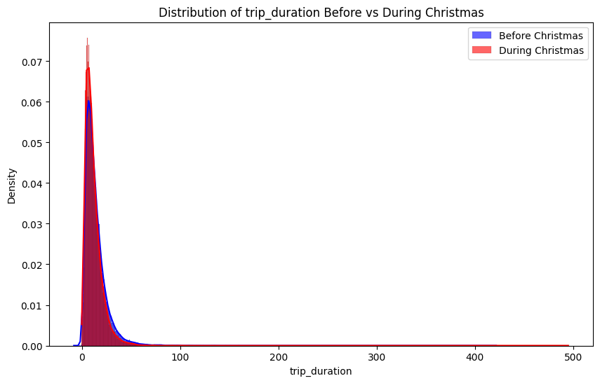

# Advanced Data Analytics and Time Series Forecasting for NYC Taxi and Dhaka Accident Dataset

## Abstract
This paper provides a comprehensive analysis of urban mobility and road safety using the 2013 New York City Taxi Trips dataset and the 2019 Bangladesh Road accident dataset. Through data preprocessing techniques, including handling missing values and feature engineering, valuable temporal and geospatial insights were extracted to understand taxi demand patterns in New York City and accident hotspots in Bangladesh. Time series forecasting models such as SARIMA and SARIMAX were applied to capture seasonal variations in taxi demand, with SARIMA effectively identifying weekly ridership trends. Geospatial analysis of the Bangladesh accident dataset revealed critical accident hotspots across various regions, with motorcycles and buses being the most frequently involved vehicles. The analysis also showed that most accidents occurred during the daytime, with a majority resulting in one or two fatalities or injuries. Clustering techniques were used to identify high-demand taxi zones in New York City and high-risk accident areas across Bangladesh. These findings offer data-driven insights for improving both urban transportation systems and road safety measures. By leveraging temporal and geographic patterns, strategic adjustments can be made to enhance traffic management, reduce congestion, and improve road safety in large cities like New York and regions across Bangladesh. This study provides essential recommendations for policymakers and urban planners focused on optimizing transportation and safety strategies.

## Table of Contents
- [Dataset](#dataset)
- [Proposed Methodology](#proposed-methodology)
- [Experimental Setups](#experimental-setups)
- [Result Analysis](#result-analysis)
- [Contact Information](#contact-information)
- [Citation](#citation)
- [License](#license)

## Dataset

The dataset used in this project is "<a href="https://www.andresmh.com/nyctaxitrips/">NYC Taxi Trips</a>" and "<a href="https://ieee-dataport.org/documents/bangladesh-road-accident-dataset">Bangladesh Road Accident Dataset</a>". In "NYC Taxi Trips" dataset, It focuses on taxi travels from January 2013 and is around 2.5GB before decompression. Although the information covers the entire year of 2013, we focused on January because to its vast size.

## Proposed Methodology
Analyzing the 2013 NYC Taxi Trips and 2019 Bangladesh Accident datasets using SARIMA, Geospatial Analysis and Clustering uncovering taxi demand trends, accident hotspots and safety insights, offering data-driven recommendations for traffic management and urban planning.

## Experimental Setups
Google Colab

## Result Analysis
### Exploratory Data Analysis (EDA) on NYC Taxi Trips Dataset
- **Correlation Matrix:**

- **Comparison of Pickup & Dropoff Taxi Data Metrics Before and During Christmas:**

- **Comparison of Various Taxi Data Metrics Before and During Christmas:**

### Geospatial Analysis on Bangladesh Road Accident Dataset
- **Various Plots Related to Accidents and Distribution Data:**

### Time Series Analysis on NYC Taxi Trips Dataset
- **Comprehensive Time Series Analysis of Rides Data:**

### K Means Clustering on NYC Taxi Trips Dataset
- **Geographical Clustering of Pickup and Dropoff Locations Before and During Christmas:**
.png)
.png)
.png)
.png)

### SARIMA & SARIMAX Model on NYC Taxi Trips Dataset
- **Comparison of SARIMA and SARIMAX Models for Predicting the Number of Rides:**

## Contact Information

For any questions or further inquiries, please feel free to reach out:

- **Shuvashis Sarkar**
  - Email: [shuvashisofficial@gmail.com](mailto:shuvashisofficial@gmail.com)

- **Shamim Rahim Refat**
  - Email: [n.a.refat2000@gmail.com](mailto:n.a.refat2000@gmail.com)

- **Arman Hasan Mahy**
  - Email: [say2mahy@gmail.com](mailto:say2mahy@gmail.com)
  
- **Azizah Mamun Abha**
  - Email: [abha.azizah800@gmail.com](mailto:abha.azizah800@gmail.com)

## License
[MIT License](LICENSE)
